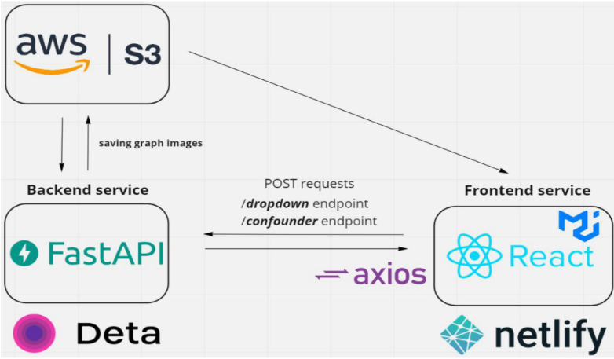

# Overcoming the Impact of Statistical Paradoxes in Expert Systems: Towards Fair and Trustworthy Decision Making
## Project link: https://simpsonparadox.netlify.app/

## Structure
- frontend React JS
- backend Fast APi 
## Architecture

■ Step 1: "Upload the CSV file and wait until the input fields are activated."
■ Step 2: "Select the input values for x and y in the dropdown list of the input fields."
■ Step 3: "In case x is categorical variable with more than 2 categories, select x1 and x2 from the dropdown list of values of x "
■ Step 4: Press the "Show" button and wait until the results are displayed 
##Disclaimer

This tool is provided as-is, and there are no guarantees that it fits your purposes or that it is bug-free. Use it at your own risk!
